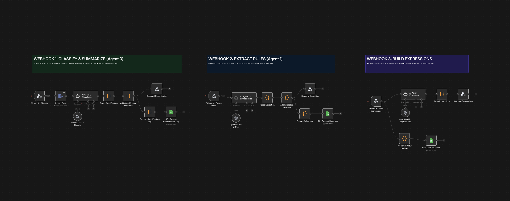
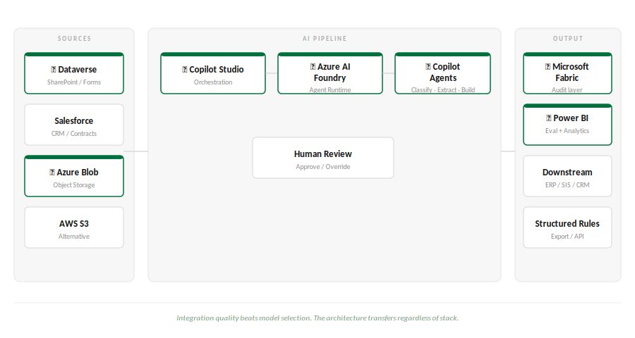

# AdContractIQ

**AI-powered contract analysis platform built for USC Upstate AI Developer submission.**

Submitted by Surya Teja Ethalapaka — suryatejae211@gmail.com

---

## The Problem

Partner contracts govern billions in revenue. Every payment, every split, every deduction lives inside a dense, cross-referenced document. Someone has to read it, interpret it correctly, and apply the rules accurately — every billing cycle, manually.

30+ hours per contract. Weeks to onboard a single deal. One misread rule means a financial error and a damaged relationship.

This is the pre-LLM era. Sales closes the deal, hands off a PDF to Legal. Legal reads it, Finance builds a spreadsheet, Engineering hard-codes the logic. Five teams. One contract. Every time.

---

## The Solution

AdContractIQ is a multi-agent document intelligence system. Three agents. Each one does exactly one job.

**Agent 0 — Contract Intelligence**
Ingests the PDF, classifies it, surfaces contract type, partner type, complexity, confidence score, and a structured summary. Human reviews before anything proceeds.

**Agent 1 — Rule Builder**
Reads the full document and extracts every calculable rule — every percentage, threshold, and condition. Each rule comes back with a confidence score and a source citation pinned to the exact page it came from. Human approves before Agent 2 runs.

**Agent 2 — Expression Builder**
Converts approved rules into step-by-step mathematical calculation chains. Every decision is logged to the audit trail simultaneously.

One agent, one job. When something fails, you know exactly where.

---

## Tech Stack

| Layer | Technology | Details |
|---|---|---|
| Frontend | React 18 + Vite | PDF.js for embedded viewer, React Router, custom CSS |
| Orchestration | n8n Cloud | 3 webhook pipelines, parallel execution, Google Sheets integration |
| AI Pipeline | LangChain + GPT-5.1 | Temperature 0, JSON schema enforcement, prompt versioning |
| Document Processing | PDF.js | Binary transmission, text extraction, page-level rendering |
| Audit Logging | Google Sheets | classification_log + rules_log, reviewed status tracking |
| Deployment | Vercel (frontend) + n8n Cloud (backend) | SPA rewrites, CORS headers configured |

---

## Live Demo

**<a href="https://adcontractiq-usc-demo.vercel.app/" target="_blank">→ Try the live demo here</a>**

> **Please use only the supplied demo contract below. Do not upload sensitive or real documents.**

### Demo Contract

Download and use this file: [`ApexMedia_SportGrid_Contract_DEMO.pdf`](./demo/ApexMedia_SportGrid_Contract_DEMO.pdf)

This is a fully synthetic contract created for demonstration purposes. All company names and financial figures are fictitious.

### What to expect

1. Upload the demo contract on the upload screen
2. Click **Classify** — Agent 0 runs and classifies the document
3. Review the classification preview — contract type, complexity, confidence score
4. Click **Continue Processing** — Agent 1 extracts the revenue rules
5. On the Rules Review screen, review the extracted rules with confidence scores and source citations. Click **Verify** on any rule to see it highlighted in the embedded PDF
6. Approve the rules and click **Finalize**
7. Agent 2 builds the mathematical calculation chains
8. Check the audit log (link below) to see your run logged in real time

---

## Audit Log

**<a href="https://docs.google.com/spreadsheets/d/1bvzlQaV4IZpXVecgE63TglmVRi9oC_LwDYoDUbrIbD8/edit?usp=sharing" target="_blank">→ View the Google Sheets audit log here</a>**

Two tabs:
- **classification_log** — every document processed, timestamped, with contract type, complexity, confidence score, and AI summary
- **rules_log** — every rule extracted, with confidence score, source citation, reviewed status, and approval timestamp

This isn't just logging. It's the beginning of an evaluation pipeline. Over time this data tells you where the model is consistently wrong, which document types need more human review, and which prompts need to be improved.

---

## Repo Structure

```
adcontractiq/
├── frontend/               # React 18 application
│   ├── src/
│   │   ├── components/     # ClassificationPreview, RulesReview, ExpressionBuilder
│   │   ├── utils/          # PDF handling, config
│   │   └── App.jsx
│   └── package.json
├── n8n/
│   └── pamv3_split_agents.json   # n8n workflow export (3 webhooks)
├── demo/
│   └── ApexMedia_SportGrid_Contract_DEMO.pdf
├── slides/
│   └── AdContractIQ_USC_Upstate.pptx
└── README.md
```

---

## Architecture



The system runs three independent n8n webhooks:

**Webhook 1 — `/classify-contract`**
Receives PDF upload → extracts text → GPT-5.1 classification agent → parses JSON → logs to `classification_log`

**Webhook 2 — `/extract-rules`**
Receives contract text → GPT-5.1 extraction agent → parses and validates rules → logs each rule to `rules_log` with `reviewed: false`

**Webhook 3 — `/build-expressions`**
Receives finalized rules → GPT-5.1 expression builder → returns calculation chains → simultaneously updates `rules_log` with `reviewed: true` and timestamp

Every agent runs at temperature 0. Structured JSON output is enforced at the parse layer. Prompt versions are tracked in the audit log.

---

## Why Three Agents

Separation of concerns. Each agent has one job, one prompt, one validation layer. If extraction starts producing bad results, I know exactly where to look. I don't debug the whole system — I debug Agent 1.

This also makes the human review gates natural. The system stops between every agent and waits for a decision. The AI proposes. The human decides. Nothing moves forward without explicit approval.

---

## Slides

The full presentation deck is in `/slides/`. It covers:
- The problem in depth
- What a complex revenue rule actually looks like
- The pre-LLM era (how this is solved today)
- AdContractIQ v0 architecture
- How I approached building this
- What this can mean for USC Upstate
- v1 architecture on Microsoft stack
- Responsible AI, security, governance, reliability considerations

---

## What Can This Mean for USC Upstate?

This system wasn't built for higher education — but the problem it solves is identical. Dense documents, complex rules, consequential decisions, and the need for a human to be accountable at every step.

Think about what moves through USC Upstate on any given week: vendor contracts, service agreements, SLAs, grant agreements with federal compliance requirements, faculty contracts, MOUs with partner institutions, software licensing agreements, data processing terms, facilities contracts. Every one of these governs something important and is currently processed manually.

Every department that touches a complex document is a potential user of this type of system.

---

## v1 — Where This Goes on Your Stack



v1 is the same architecture running on Microsoft infrastructure:

- **Orchestration** — n8n → Microsoft Copilot Studio ⭐
- **Agent Runtime** — LangChain → Azure AI Foundry ⭐
- **Document Sources** — Manual upload → Dataverse / SharePoint / Salesforce ⭐
- **Audit & Data Layer** — Google Sheets → Microsoft Fabric ⭐
- **Analytics** — Power BI ⭐
- **Agents** — GPT-5.1 → Copilot Agents ⭐

The architecture was designed around the right principles from the start — separation of concerns, human review gates, structured outputs, audit trails. Those principles transfer directly to the Microsoft stack. Microsoft's ecosystem in higher education also brings FERPA compliance and data residency built into the platform, not bolted onto the application.

⭐ = USC Upstate stack

---

## Responsible AI in Document Processing

LLMs hallucinate. In document extraction, that means wrong rules — confident extractions from text that doesn't exist, misread percentages, invented thresholds. In a system that feeds a billing or compliance pipeline, each one is a real error.

This system addresses that structurally:

- **Confidence scoring** — every extracted rule carries a score. Low confidence surfaces as a visible red flag, not a hidden assumption
- **Source citations** — every rule links to the exact section it came from. The reviewer can verify the model read the contract correctly before approving anything
- **Human gates** — no agent acts autonomously on consequential data. Every checkpoint is a deliberate design decision, not a fallback
- **Audit trail** — every run is logged. What the model produced, who reviewed it, who approved it, and when

---

## Security and Data Governance

Documents are not inert data. Contracts contain sensitive financial terms, institutional commitments, and personal information. In a university context, much of this falls under FERPA.

Key considerations built into this system:

- Every document interaction is logged and attributable — who uploaded it, what the model produced, who reviewed it, who approved it
- In v1, Microsoft Fabric and Dataverse handle data residency, access controls, and compliance at the enterprise level — built into the platform, not the application
- Role-based access, institutional SSO, and permission scoping are table stakes for enterprise deployment

---

## Reliability, Accessibility, and Privacy

**Reliability** — API timeouts, model errors, and malformed outputs each have defined fallbacks. The system degrades gracefully, not silently.

**Accessibility** — built for finance analysts, contract managers, and administrators — not engineers. Confidence scoring is expressed as green/yellow/red. The AI's uncertainty is legible to someone who has never heard of a confidence score.

**Privacy** — contracts contain PII, sometimes health information or student data. What gets sent to the model, how it's stored, and when it's deleted are all explicit decisions, not assumptions.

---

## Contact

Surya Teja Ethalapaka
suryatejae211@gmail.com
551-349-3386